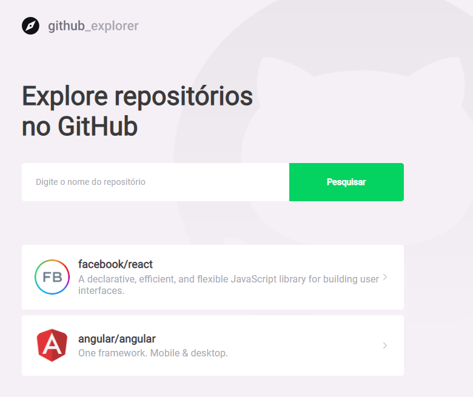
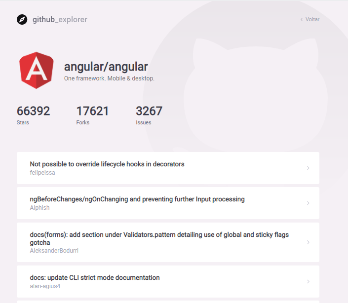

<h1 align="center">
GitHub Explorer / DashBoard
 
 
  
 
</h1>

This first page represents the dashboard. The feature would be to search for a repository based on what is typed in the text field. The value for finding a valid repository must be user/repository.

 
 
 
 
 
<h1 align="center">
GitHub Explorer / Repository
 
 
  
 
</h1>

This page has the feature to list all issues in the repository selected on the Dashboard page. When clicking on any issue, you are redirected to the issue of that repository on the GitHub website.

## 💻 Techs ##
<ul>
  <li style="list-style: none;">🟢 TypeScript</li>
  <li style="list-style: none;">🟢 ReactJs</li>
  <li style="list-style: none;">🟢 API GitHub</li>
</ul>
 

## 🚀 How to use the application?  ##
<ul>
  <li style="list-style: none;">✅ git clone https://github.com/ga-almeida/git-explorer-project.git</li>
  <li style="list-style: none;">✅ Within the folder of the cloned project run the "yarn" command.</li>
  <li style="list-style: none;">✅ After downloading the project's dependencies. Run the "yarn start" command.</li>
</ul>
 

The objective of this project was to practice development using ReactJs.

